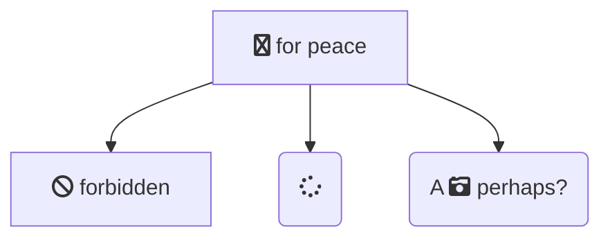

# Sustainable API Architecture

An example of the Sustainable API Architecture, built in C# on the .NET Core framework. There are comments throughout explaining rationale, and going over things detailed in the architecture overview.

This project works, so you can clone the repo and run it yourself. You can then hit the following endpoints:

- The default endpoint, `https://localhost:5001/weatherforecast` will show 0 results.
- `https://localhost:5001/weatherforecast?days=5` will show 5 results (as will 1-4, with fewer results)
- `https://localhost:5001/weatherforecast?days=6` (or higher) will throw an error, as there's only 5 results

If you wish to delve through the application step by step, you can do so in the following order:

1. [Controller - API Layer](https://github.com/apeacock1991/sustainable-api-architecture/blob/main/sustainable-api-architecture/Controllers/WeatherForecastController.cs)
2. [Service - Application Layer](https://github.com/apeacock1991/sustainable-api-architecture/blob/main/sustainable-api-architecture/Services/RetrieveForecast.cs)
3. [Repository - Repository & Adapter Layer](https://github.com/apeacock1991/sustainable-api-architecture/blob/main/sustainable-api-architecture/Repositories/ForecastRepository.cs)
4. [Weather Forecast Domain Entity - Domain Layer](https://github.com/apeacock1991/sustainable-api-architecture/blob/main/sustainable-api-architecture/Models/WeatherForecast.cs)
5. [Forecast File Reader - Infrastructure Layer](https://github.com/apeacock1991/sustainable-api-architecture/blob/main/sustainable-api-architecture/Infrastructure/ForecastFileReader.cs)

Please note, this is not the depdendency graph, but is the flow of control. This is due to most layers leveraging Dependency Inversion. You can see where we register our dependencies [here](https://github.com/apeacock1991/sustainable-api-architecture/blob/main/sustainable-api-architecture/Startup.cs#L26).

Finally, there are a couple of examples in the tests [here](https://github.com/apeacock1991/sustainable-api-architecture/tree/main/sustainable-api-architecture-tests). By no means is the test suite exhaustive, the main reason for adding was to show how the tests work for the Repository, which you can see [here](https://github.com/apeacock1991/sustainable-api-architecture/blob/main/sustainable-api-architecture-tests/Repositories/ForecastRepositoryTests.cs). Note how we're able to easily isolate the Repository, therefore performing a unit test with ease - and it would be even easier using a framework that enables stubs!

